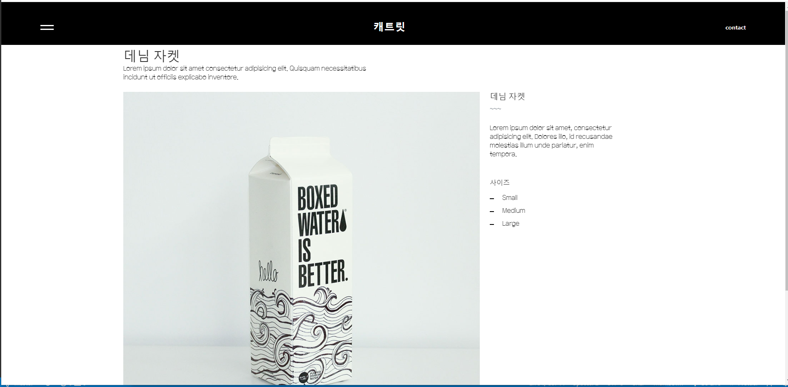
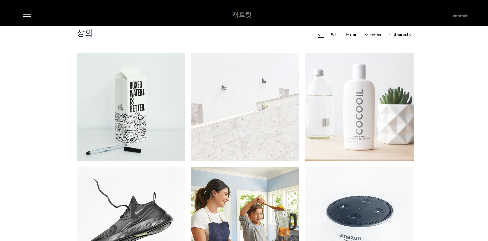

##  🍎 Rendezvous
> 이름: 전승현(팀장: Web - 코딩)<br>
  졸업작품 소개 사이트: https://github.com/jeonseunghyeon/Rendezvous<br>
  포트폴리오 소개 사이트: URL

| Week | 참여| 회의 내용 |
| -----| -- |------------- |
| 1주차 | ☑️|  작품 기술서 작성, 역할 배정  
| 2주차 | ☑️|  디자인 시안 공유 및 사진 촬영 작업, 폰트 및 컬러  설정|
| 3주차 |    |    |
| 4주차 |    |    |
| 5주차 |    |    |
| 6주차 |    |    |
| 7주차 |    |    |
| 8주차 |    |    |


   </br>


   # 📑 프로젝트 소개
> 화장품을 소개하는 웹 사이트입니다. </br>
> 제작 기간 : 2022년 03월 ~ ing


</br>


## 🛠 개발 환경
- Visual Studio Code
- lllustrator
- XD


</br>


### 2022.05.25
---
##### 오늘의 개발일지
- 아우터 카테고리의 상품 등록(항공 점퍼)
- 부트스트랩을 이용하여 반응형 설정
- 발표전 마무리 단계(오타 수정)
- 졸업작품 관련 리포트 작성(부족한 점 및 보완할 점 작성)


### 2022.05.18
---
##### 오늘의 개발일지
- 디자인팀이 상세페이지 작성 완료
- 하의, 악세사리 카테고리 페이지 구현
- 이미지 적용시키고 마무리 단계 진행 중


### 2022.05.11
---
##### 오늘의 개발일지
- 단일 상품 소개 페이지 구현(부트스트랩)
- 다음 주 할 일
1. 디자인팀에서 상품 설명 페이지를 포토샵으로 만들어 나한테 보내주면
   적용시키기
2. 각각의 페이지 다듬기
- --- 오류---
- 상품 소개 페이지에서 화면 비율에 따라 푸터 부분이 잘리거나 보임
(어떻게 건들여야 하는지 모르겠다..) 

단일 상품 소개 페이지(설명)


### 2022.05.04
---
##### 오늘의 개발일지
- 상품 소개 페이지 구현(부트스트랩 이용)
- 오류 
1. 상품 소개 페이지에서 헤더 부분 호버시 텍스트가 잘리는 현상 발견(이유는 모르겠음;)
- 상품 소개 페이지 이미지



### 2022.04.28
---
##### 오늘의 개발일지
- 사이트 컨셉 변경(화장품 -> 의류 편집샵)
- 메인 페이지 구현 완료
- 제품 설명 페이지 구현 회의(어떤 식으로 만들지, 사용 프로그램)
- 제품 소개 페이지 구현 시작(카드 레이아웃 이용)
- 시험 준비로 인해 많은 작업 하지 않음;

### 2022.04.13 
---
##### 오늘의 개발일지
- 사이트 배경 색상 적용(검정,흰색)
- 각각의 div에 margin을 주면 footer의 내용들이 잘리는 오류  발견<br>(아직 고치지 못함; css 공부 후에 고칠 예정)
- 마우스 오버시 이미지 변경 작업 완료(onmouseover,onmouseout을 이용)
```html
 
```

### 2022.04.03 
---
##### 오늘의 개발일지
- 마우스 커서 변경
- 애니메이션 효과 적용
- 100MB이상 파일 깃허브 업로드 방법 터득


### 2022.03.31 
---
##### 오늘의 개발일지
- 저널 페이지 구현
- 깃허브 협업(연동)
- Footer 구현
- 디자인 시안 공유 및 사진 촬영 작업 (회의내용) 
- 폰트 및 컬러 결정(회의내용)
- 예시 사이트 검색(회의내용)


  


